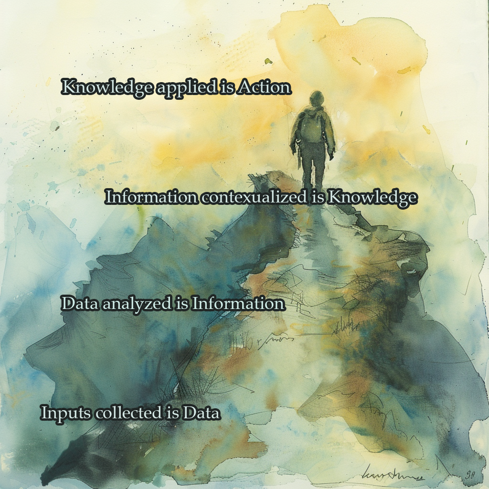

    
This framework anchors the project of this page.  Design is the process of taking nothing to something great.  Data scientists find themselves the lynch pin between many realms - the highly technical modeling and quantative analysis, the engineering support that allows data science to exist but also between data clients and data customers.  A good data scientist is a designer and thus is responsible for the whole ecosystem that results in a data product.  Each step has important stakeholders and contributors who make the whole thing work but it's my contention that a holistic responsible party is often missing resulting in miscommunication, design failures, and a loss of trust.  The posts on this page are sketches to help design the whole.  